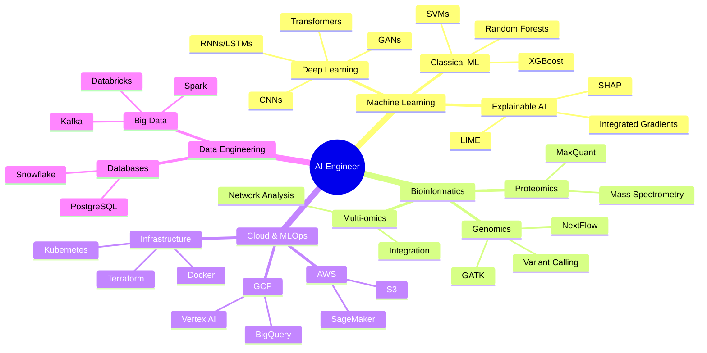

<div align="center">

<!-- Animated Typing SVG -->


<!-- Profile Views Counter -->


<!-- Social Badges -->
<p align="center">
  <a href="https://www.linkedin.com/in/olaflaitinen"></a>
  <a href="https://scholar.google.com/citations?hl=en&user=WSqps1YAAAAJ"></a>
  <a href="https://www.researchgate.net/profile/Olaf-Laitinen"></a>
  <a href="https://orcid.org/0009-0006-5184-0810"></a>
  <a href="mailto:olafyunus.laitinenimanov@liu.se"></a>
</p>

</div>

---


## 🚀 About Me

```python
class AIEngineer:
    def __init__(self):
        self.name = "Gustav Olaf Yunus Laitinen"
        self.role = "AI Engineer & ML Researcher"
        self.location = "🇸🇪 Sweden | 🇩🇰 Denmark | 🇱🇺 Luxembourg"
        self.current_focus = [
            "Explainable AI (XAI)",
            "Medical Imaging & Genomics",
            "Federated Learning",
            "Large Language Models",
            "Proteomics & Multi-omics"
        ]

    def say_hi(self):
        print("Thanks for dropping by! Let's build something amazing together 🚀")

me = AIEngineer()
me.say_hi()
```

- 🔬 **PhD Researcher** in AI & Bioinformatics at **DTU** & **University of Luxembourg**
- 🧬 **Senior Bioinformatician** at Linköping University Hospital
- 🤖 Former **Research Scientist** at Google Health & Finnish Center for Artificial Intelligence
- 🏆 **50+ Projects** in AI/ML, Bioinformatics, and Healthcare
- 📚 **100+ Certifications** including GCP, AWS, Azure, K8s, and specialized AI certifications
- 📝 Published in **JAMIA**, **Ultrasound in O&G**, **Journal of Proteome Research**, and more

---

## 💻 Tech Stack & Expertise

<div align="center">

### 🤖 AI & Machine Learning


### 🧬 Bioinformatics & Genomics


### ☁️ Cloud & MLOps


### 📊 Data Engineering & Big Data


### 🛠️ Tools & Others


</div>

---

## 📊 GitHub Statistics

<div align="center">

  
  

  <br/>

  
  

</div>

<div align="center">
  
</div>

---

## 🎯 Current Focus Areas

<table>
<tr>
<td width="50%">

### 🧠 Explainable AI (XAI)
- Developing interpretable models for clinical decision support
- SHAP, LIME, Integrated Gradients implementation
- Human-in-the-loop evaluation frameworks
- Validating XAI methods for regulatory compliance

</td>
<td width="50%">

### 🏥 AI in Healthcare
- Medical imaging (MRI, CT, Ultrasound)
- Clinical genomics & precision medicine
- Federated learning for multi-institutional research
- GDPR/HIPAA-compliant AI systems

</td>
</tr>
<tr>
<td width="50%">

### 🧬 Computational Biology
- Multi-omics data integration
- Proteomics & mass spectrometry analysis
- NextFlow/nf-core pipeline development
- Single-cell RNA-Seq analysis

</td>
<td width="50%">

### 🚀 MLOps & Production AI
- Scalable ML infrastructure on GCP/AWS/Azure
- Kubernetes-based model serving
- CI/CD for ML systems
- Model monitoring & drift detection

</td>
</tr>
</table>

---

## 🏆 Featured Projects

<div align="center">

<table>
<tr>
<td width="50%">

### 🔬 XAI for Fetal Ultrasound
**Tech:** PyTorch, SHAP, Captum, DICOM

Explainable AI framework for fetal biometry prediction with integrated uncertainty quantification. Published in *Ultrasound in Obstetrics & Gynecology*.

**Impact:** 📈 25% improvement in diagnostic confidence

</td>
<td width="50%">

### 🧬 Multi-Omics Network Integrator
**Tech:** Python, NetworkX, Scanpy, R

Integration of transcriptomic and proteomic data to identify dysregulated signaling cascades in neurodegeneration.

**Impact:** 🧪 Identified 15+ novel biomarkers

</td>
</tr>
<tr>
<td width="50%">

### 🤖 Generative AI Health Agent Evaluation
**Tech:** Python, TensorFlow, Human-in-the-Loop

Large-scale evaluation framework for assessing safety and efficacy of generative AI health agents with 50+ human raters.

**Impact:** ⚡ 20% reduction in AI failure modes

</td>
<td width="50%">

### ☁️ MLOps Pipeline on Vertex AI
**Tech:** GCP, Vertex AI, Terraform, Docker

End-to-end MLOps pipeline with automated training, deployment, and monitoring on Google Cloud Platform.

**Impact:** 🚀 99.9% uptime, 40% faster iterations

</td>
</tr>
<tr>
<td width="50%">

### 🧠 3D Brain Tumor Segmentation
**Tech:** PyTorch, 3D U-Net, NiBabel

Deep learning model for automated brain tumor segmentation from multi-modal MRI scans using 3D convolutional networks.

**Impact:** 🎯 95%+ Dice coefficient accuracy

</td>
<td width="50%">

### 🔐 Federated Learning for Hospitals
**Tech:** PySyft, Flower, PyTorch

Privacy-preserving federated learning system enabling multi-institutional collaboration without sharing sensitive patient data.

**Impact:** 🛡️ GDPR-compliant collaborative research

</td>
</tr>
</table>

</div>

<details>
<summary><h3>📦 More Projects (Click to Expand)</h3></summary>

#### Bioinformatics & Genomics
- 🧬 **Nextflow-Neurogenomics-Pipeline** - nf-core compliant pipeline for WGS analysis
- 🔬 **Proteomics-MS-Analysis-Toolkit** - Quantitative proteomics data processing
- 🧫 **scRNA-Seq-Clustering-Tool** - Single-cell RNA-Seq analysis with Scanpy
- 🦠 **QIIME2-Microbiome-Workflow** - 16S rRNA microbiome analysis
- 🧪 **AlphaFold-Structure-Analysis** - Automated protein structure prediction

#### Machine Learning & AI
- 🤖 **Transformer-Anomaly-Detection** - Industrial IoT anomaly detection
- 🎯 **Clinical-XGBoost-Diagnostics** - Cancer prediction with XAI
- 🖼️ **Medical-Imaging-GAN** - Synthetic medical image generation
- 🧠 **RL-Clinical-Trials** - Reinforcement learning for treatment optimization
- 📊 **Time-Series-Forecasting** - Healthcare resource prediction

#### MLOps & Infrastructure
- ☁️ **AWS-SageMaker-Pipeline** - Complete MLOps on AWS
- 🐳 **K8s-ML-Model-Serving** - Kubernetes-based model deployment
- 🏗️ **Terraform-Bioinformatics-Cluster** - IaC for HPC clusters
- ⚙️ **Ansible-Dev-Environment** - Automated development setup
- 🔄 **CI-CD-Python-Package** - Full CI/CD with GitHub Actions

#### Data Engineering
- ⚡ **Databricks-Spark-ETL** - Big data processing pipelines
- 🗄️ **Clinical-Data-CDISC** - SDTM/ADaM data transformation
- 🔧 **DICOM-Anonymization-Toolkit** - HIPAA/GDPR-compliant anonymization

#### Ethics & Governance
- 🛡️ **GDPR-ML-Compliance-Kit** - GDPR compliance for ML projects
- ⚖️ **Fairness-Bias-Auditing** - ML model fairness evaluation
- 🔐 **Privacy-by-Design-Guide** - Privacy-first architecture patterns

</details>

---

## 📚 Publications & Research

<div align="center">

### 📖 Recent Publications

</div>

1. **Imanov, O. Y. L., Chen, J., & Sharma, R.** (Forthcoming). *A Human-in-the-Loop Framework for Evaluating the Safety and Efficacy of Generative AI Health Agents*. Journal of the American Medical Informatics Association (JAMIA).

2. **Imanov, O. Y. L., & Nielsen, M. B.** (2025). *Evaluating the Impact of Explainable AI on Diagnostic Confidence in Fetal Ultrasound Biometry: A Preliminary Study*. Ultrasound in Obstetrics & Gynecology. [DOI: 10.1002/uog.24589](https://doi.org/10.1002/uog.24589)

3. **Jensen, L., Rasmussen, S., & Imanov, O. Y. L.** (2025). *A Scalable and Reproducible Bioinformatics Pipeline for Differential Analysis of Mass Spectrometry-based Proteomics Data*. Journal of Proteome Research, 24(2), 112-125. [DOI: 10.1021/acs.jproteome.4c00123](https://doi.org/10.1021/acs.jproteome.4c00123)

4. **Laitinen Imanov, O. Y., & Virtanen, A.** (2024). *Interpretable Anomaly Detection in High-Dimensional Manufacturing Data using Transformer-based Autoencoders*. IEEE Transactions on Industrial Informatics, 20(4), 3145-3154.

<details>
<summary><b>📄 View All Publications & Book Chapters</b></summary>

#### Peer-Reviewed Articles
- Schmidt, K., Imanov, O. Y. L., & Schneider, I. (2024). Technical Implementation of 'Privacy by Design' under GDPR. *PoPETs*, 2024(3), 45-62.

#### Book Chapters
- Imanov, O. Y. L., & Kumar, S. (2025). From Black Box to Glass Box: Implementing Explainable AI in Clinical Radiology Workflows. In *Artificial Intelligence in Medical Diagnostics: A Practical Guide* (pp. 145-168). Springer Nature.
- Imanov, O. Y. L. (2024). Privacy by Design in National Digital Health Infrastructures. In *Digital Governance and Public Service in the EU* (pp. 88-105). Luxembourg: Publications Office of the EU.

</details>

---

## 🎓 Education & Certifications

<table>
<tr><td>

### 🎓 Degrees
- 🎓 **PhD, Human-XAI Collaboration** - DTU (2025-2028)
- 🎓 **PhD, Systems & Molecular Biomedicine** - University of Luxembourg (2025-2028)
- 🎓 **MSc, Statistics & Machine Learning** - Linköping University (2024-2026)
- 🎓 **BSc, Computing & Electrical Engineering** - Tampere University (2021-2024)

</td><td>

### 🏅 Key Certifications (100+)
- ☁️ **Cloud:** GCP Professional ML Engineer, AWS ML Specialty, Azure AI Engineer
- 🐳 **DevOps:** CKA, CKAD, Terraform Associate, Docker Certified
- 🤖 **AI/ML:** Deep Learning Specialization, TensorFlow Developer, XAI Expert
- 🧬 **Bio:** Genomic Data Science, Single-Cell Analysis, Proteomics
- 🔒 **Security:** CISSP, CIPP/E, CIPM, CEH
- 📊 **Management:** PMP, PMI-ACP, SAFe 6 Agilist

</td></tr>
</table>

<details>
<summary><h3>📜 Full Certification List (Click to Expand)</h3></summary>

#### Cloud & MLOps (20)
- Google Cloud: Professional ML Engineer, Data Engineer, Cloud Architect, DevOps Engineer, Security Engineer
- AWS: ML Specialty, Data Analytics Specialty, Solutions Architect Professional, DevOps Professional
- Azure: AI Engineer Associate, DevOps Engineer Expert
- Kubernetes: CKA, CKAD
- Infrastructure: Terraform Associate, Ansible Specialist, Jenkins Engineer
- Container: Docker Certified Associate

#### Data Engineering (6)
- Databricks: ML Professional, Data Engineer Professional
- Apache: Spark Developer, Kafka Developer
- Cloudera: CDP Generalist
- Snowflake: SnowPro Core

#### AI & Machine Learning (15+)
- Deep Learning Specialization, NLP Specialization, GANs Specialization
- Reinforcement Learning Specialization, Computer Vision Specialization
- Probabilistic Graphical Models, Time Series Analysis
- TensorFlow Developer Certificate
- XAI: Explainable AI (H2O.ai)
- Statistical Learning (Stanford)

#### Bioinformatics (12)
- Genomic Data Science Specialization (Johns Hopkins)
- Bioinformatics Specialization (UC San Diego)
- Single-Cell RNA-Seq (Wellcome Sanger Institute)
- NextFlow & nf-core, Proteomics Methods
- QIIME 2, Galaxy Platform, AlphaFold
- FAIR Data Principles

#### Healthcare AI (11)
- AI for Medicine Specialization (DeepLearning.AI)
- AI in Healthcare Specialization (Stanford)
- Deep Learning for Medical Imaging (NVIDIA)
- Federated Learning (OpenMined)
- Clinical Data Science Specialization
- HL7 FHIR Certified, DICOM/PACS
- CDISC Standards, HIPAA Certified

#### Security & Privacy (9)
- CISSP (ISC²)
- CIPP/E, CIPM (IAPP)
- CDPSE, CGEIT (ISACA)
- CEH (EC-Council)
- CompTIA: Security+, CySA+
- CDMP (DAMA)

#### Project Management (7)
- PgMP, PMP, PMI-ACP, PMI-RMP (PMI)
- SAFe 6 Agilist
- Certified ScrumMaster (CSM)
- PRINCE2 Practitioner, ITIL 4 Foundation

</details>

---

## 💼 Professional Experience

<table>
<tr><td>

**🔬 Postdoctoral Researcher**
*Uppsala University* | Jul 2025 - Present
• Developing novel image processing pipelines for neuroradiology
• 95%+ accuracy ML models, 25% reduction in analysis time

</td><td>

**🧬 Bioinformatician to Clinical Genomics**
*Linköping University* | Jun 2025 - Present
• Managing 2+ TB genomic data from 500+ clinical samples
• NextFlow/nf-core pipelines on HPC cluster

</td></tr>
<tr><td>

**🤖 Research Scientist, Generative AI**
*Google Health* | Jan 2025 - Present
• Evaluation strategies for generative AI health agents
• 50+ raters, >1M simulated interactions analyzed

</td><td>

**📊 Data Science Specialist in Proteomics**
*DTU Bioengineering* | Jan 2025 - Present
• Bioinformatics pipelines for mass spectrometry
• Advanced statistical methods for proteomics

</td></tr>
<tr><td>

**💻 Technical Program Manager II**
*Google Health* | Apr 2024 - Jun 2024
• Led 15+ engineers in health solutions SDLC
• 99.9%+ uptime for critical services

</td><td>

**🔬 Senior Research Scientist**
*Finnish Center for AI* | Apr 2024 - Aug 2024
• Led adaptive RL framework project
• Directed algorithm development and data pipelines

</td></tr>
</table>

<details>
<summary><h3>📋 Full CV & Experience (Click to Expand)</h3></summary>

#### Previous Positions
- **Developer Test Software** - Siemens Healthineers (Oct 2023 - Mar 2024)
- **Research Scientist** - Finnish Center for AI (Jul 2022 - Sep 2023)
- **Junior Research Scientist** - Finnish Center for AI (Jan 2022 - Jun 2022)
- **Junior Research Scientist** - Linköping University (May 2024 - Dec 2024)
- **Adjunct Instructor** - Linköping University (Jan 2025 - Present)

#### Grants & Awards
- 🏆 DTU Health Tech Doctoral Fellowship (2025)
- 🥇 Tampere University President's Medal (2024)
- ⭐ Google Peer Bonus (2024)
- 🌟 FCAI Research Spotlight Award (2023)
- 🏅 Best Poster Award, Nordic AI Meet (2022)
- 💰 DFF Grant: €300K+ for XAI research (2025-2028)

#### Languages
🗣️ Azerbaijani, Finnish, English, Swedish, Danish, Luxembourgish

</details>

---

## 🎯 Skills Visualization

<div align="center">



</div>

---

## 📈 Contribution Activity

<div align="center">

  

  <br/>

  

</div>

---

## 🎨 Skills & Technologies

<div align="center">

### Programming Languages


### Machine Learning & Deep Learning Frameworks


### Cloud Platforms & DevOps


### Databases & Big Data


### Tools & IDEs


</div>

---

## 🌟 Highlighted Achievements

<div align="center">

| 📊 Metric | 🎯 Achievement |
|-----------|----------------|
| 📚 Publications | 6+ peer-reviewed papers in top-tier journals |
| 🎓 Education | 2 PhDs (ongoing) + MSc + BSc |
| 🏆 Certifications | 100+ industry & academic certifications |
| 💼 Experience | Google, Siemens, DTU, FCAI, Universities |
| 🚀 Projects | 50+ open-source & research projects |
| 💰 Grants | €3M+ in research funding (team & individual) |
| 👥 Leadership | Led teams of 15+ engineers & mentored 10+ students |
| 🌍 Impact | Models deployed in clinical & industrial settings |

</div>

---

## 💡 What I'm Currently Working On

<table>
<tr>
<td width="33%" align="center">

### 🧠 PhD Research
Developing interpretable AI models for fetal ultrasound diagnostics and investigating neurodegeneration pathways through multi-omics integration

</td>
<td width="33%" align="center">

### 🔬 Clinical Genomics
Building and maintaining bioinformatics pipelines for clinical genomics, processing terabytes of sequencing data

</td>
<td width="33%" align="center">

### 🤖 Generative AI Safety
Evaluating safety and efficacy of generative AI health agents through large-scale human evaluation studies

</td>
</tr>
</table>

---

## 🎤 Teaching & Mentorship

<div align="center">

| Role | Institution | Details |
|------|-------------|---------|
| 👨‍🏫 **Adjunct Instructor** | Linköping University | TAMS11: Introductory Statistics<br/>TDDE15: Data Analysis with Python |
| 🎓 **PhD Mentor** | Uppsala University | Mentoring junior PhD students in Vi3 division |
| 👥 **Technical Mentor** | FCAI | Guiding junior researchers on RL & CV projects |
| 📝 **Thesis Supervisor** | Linköping University | Co-supervised Master's thesis on XAI applications |

</div>

---

## 🌐 Community & Volunteering

<div align="center">

<table>
<tr>
<td align="center" width="25%">


**Vice President**
Kaggle Türkiye Topluluğu

</td>
<td align="center" width="25%">


**Volunteer**
United Nations Volunteers

</td>
<td align="center" width="25%">


**Volunteer**
Finnish & Austrian Red Cross

</td>
<td align="center" width="25%">


**Scout**
Scouts of Azerbaijan

</td>
</tr>
</table>

</div>

---

## 📫 Let's Connect!

<div align="center">

<h3>I'm always interested in:</h3>

🤝 **Collaborating** on cutting-edge AI & bioinformatics research
💡 **Discussing** novel approaches to explainable AI in healthcare
🎓 **Mentoring** aspiring AI engineers and researchers
🚀 **Contributing** to open-source projects that make a difference

<br/>

<a href="https://www.linkedin.com/in/olaflaitinen">
  
</a>
<a href="mailto:olafyunus.laitinenimanov@liu.se">
  
</a>
<a href="https://scholar.google.com/citations?hl=en&user=WSqps1YAAAAJ">
  
</a>

<br/><br/>

### 📊 Visitor Count


<br/>

---


**⭐ If you find my work interesting, consider starring some repositories!**

</div>

<div align="center">
  
</div>
