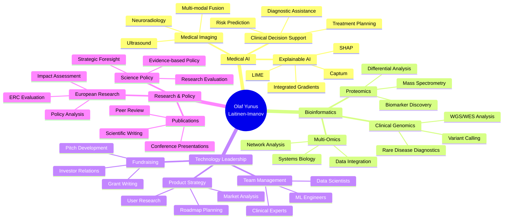

<!-- Animated Banner -->
<picture>
  <source media="(prefers-color-scheme: dark)" srcset="https://raw.githubusercontent.com/olaflaitinen/olaflaitinen/claude/initial-setup-011CUtjgwmgsTSKqQiUtzpTg/assets/animated-banner.svg">
  <source media="(prefers-color-scheme: light)" srcset="https://raw.githubusercontent.com/olaflaitinen/olaflaitinen/claude/initial-setup-011CUtjgwmgsTSKqQiUtzpTg/assets/animated-banner.svg">
  
</picture>

 

<!-- Animated Typing Header -->
<picture>
  <source media="(prefers-color-scheme: dark)" srcset="https://readme-typing-svg.demolab.com?font=Fira+Code&size=28&duration=2800&pause=2000&color=58A6FF&center=true&vCenter=true&width=940&lines=Olaf+Yunus+Laitinen-Imanov;CTO+at+Skolyn+%7C+AI+HealthTech+Innovator;Postdoctoral+Researcher+in+Medical+AI;ERC+Policy+Expert+%7C+Google+Health+AI+Scientist;Building+Trustworthy+AI+for+Healthcare">
  <source media="(prefers-color-scheme: light)" srcset="https://readme-typing-svg.demolab.com?font=Fira+Code&size=28&duration=2800&pause=2000&color=0969DA&center=true&vCenter=true&width=940&lines=Olaf+Yunus+Laitinen-Imanov;CTO+at+Skolyn+%7C+AI+HealthTech+Innovator;Postdoctoral+Researcher+in+Medical+AI;ERC+Policy+Expert+%7C+Google+Health+AI+Scientist;Building+Trustworthy+AI+for+Healthcare">
  
</picture>

<h3>
  <i>CTO & Co-Founder at Skolyn | Postdoctoral Researcher | ERC Policy Expert 
  Medical AI · Clinical Genomics · Explainable AI · Federated Learning · Multi-Omics</i>
</h3>

<!-- Profile Views Counter -->
<picture>
  <source media="(prefers-color-scheme: dark)" srcset="https://komarev.com/ghpvc/?username=olaflaitinen&label=Profile%20Views&color=58a6ff&style=flat-square">
  <source media="(prefers-color-scheme: light)" srcset="https://komarev.com/ghpvc/?username=olaflaitinen&label=Profile%20Views&color=0969da&style=flat-square">
  
</picture>

<!-- Social Badges -->

  
  
  
  
  

<!-- Location & Contact -->

  <strong>Location:</strong> Greater Linköping Metropolitan Area, Sweden 
  <strong>Address:</strong> Fårsaxvägen 31, 586 66 Linköping 
  <strong>Phone:</strong> +46 76 236 80 88 | <strong>Email:</strong> olafylimanov@skolyn.se

---

## Professional Summary

<table>
<tr>
<td width="70%">

I am a **Postdoctoral Researcher**, **CTO & Co-Founder**, and **Research Scientist** driving innovation at the intersection of **artificial intelligence**, **bioinformatics**, and **clinical medicine**. My mission is to build **explainable**, **trustworthy AI systems** that improve patient outcomes and transform healthcare delivery.

**Current Roles:**
- **CTO & Co-Founder** @ Skolyn (AI HealthTech - Clinical Co-Pilot)
- **Seconded National Expert** @ European Research Council (ERC) - Policy Analysis
- **Postdoctoral Researcher** @ Uppsala University (Medical AI & Imaging)
- **Bioinformatician** @ Linköping University (Clinical Genomics)
- **Research Scientist** @ Google Health AI (Generative AI Evaluations)
- **Data Science Specialist** @ DTU Bioengineering (Proteomics)

With **dual PhDs in progress** (Systems & Molecular Biomedicine at University of Luxembourg; Human-XAI Collaboration at DTU), an **MSc in Statistics & Machine Learning** (Linköping), and a **BSc in Computing & Electrical Engineering** (Tampere), I combine deep technical expertise with strategic leadership.

</td>
<td width="30%">

### Quick Stats
- **6+** Publications
- **2** PhDs (ongoing)
- **40+** Certifications
- **€3M+** Grants Secured
- **15+** Teams Led
- **50+** Projects
- **500+** Clinical Cases
- **2TB+** Data Processed

</td>
</tr>
</table>

---

## GitHub Statistics & Metrics

<!-- Main Stats Row -->
<picture>
  <source media="(prefers-color-scheme: dark)" srcset="https://github-readme-stats.vercel.app/api?username=olaflaitinen&show_icons=true&theme=github_dark&hide_border=true&count_private=true&include_all_commits=true&bg_color=0d1117&title_color=58a6ff&text_color=c9d1d9&icon_color=58a6ff">
  <source media="(prefers-color-scheme: light)" srcset="https://github-readme-stats.vercel.app/api?username=olaflaitinen&show_icons=true&theme=default&hide_border=true&count_private=true&include_all_commits=true">
  
</picture>

<picture>
  <source media="(prefers-color-scheme: dark)" srcset="https://github-readme-streak-stats.herokuapp.com/?user=olaflaitinen&theme=github-dark-blue&hide_border=true&background=0d1117&ring=58a6ff&fire=58a6ff&currStreakLabel=58a6ff">
  <source media="(prefers-color-scheme: light)" srcset="https://github-readme-streak-stats.herokuapp.com/?user=olaflaitinen&theme=default&hide_border=true">
  
</picture>

 

<!-- Language & Activity Row -->
<picture>
  <source media="(prefers-color-scheme: dark)" srcset="https://github-readme-stats.vercel.app/api/top-langs/?username=olaflaitinen&layout=compact&theme=github_dark&hide_border=true&langs_count=10&bg_color=0d1117&title_color=58a6ff&text_color=c9d1d9">
  <source media="(prefers-color-scheme: light)" srcset="https://github-readme-stats.vercel.app/api/top-langs/?username=olaflaitinen&layout=compact&theme=default&hide_border=true&langs_count=10">
  
</picture>

<picture>
  <source media="(prefers-color-scheme: dark)" srcset="https://github-profile-summary-cards.vercel.app/api/cards/stats?username=olaflaitinen&theme=nord_dark">
  <source media="(prefers-color-scheme: light)" srcset="https://github-profile-summary-cards.vercel.app/api/cards/stats?username=olaflaitinen&theme=default">
  
</picture>

<!-- GitHub Metrics Detailed -->

 

<!-- GitHub Profile Summary Cards -->

<picture>
  <source media="(prefers-color-scheme: dark)" srcset="https://github-profile-summary-cards.vercel.app/api/cards/profile-details?username=olaflaitinen&theme=nord_dark">
  <source media="(prefers-color-scheme: light)" srcset="https://github-profile-summary-cards.vercel.app/api/cards/profile-details?username=olaflaitinen&theme=default">
  
</picture>

 

<!-- Additional Metrics Cards -->
<picture>
  <source media="(prefers-color-scheme: dark)" srcset="https://github-profile-summary-cards.vercel.app/api/cards/repos-per-language?username=olaflaitinen&theme=nord_dark">
  <source media="(prefers-color-scheme: light)" srcset="https://github-profile-summary-cards.vercel.app/api/cards/repos-per-language?username=olaflaitinen&theme=default">
  
</picture>

<picture>
  <source media="(prefers-color-scheme: dark)" srcset="https://github-profile-summary-cards.vercel.app/api/cards/most-commit-language?username=olaflaitinen&theme=nord_dark">
  <source media="(prefers-color-scheme: light)" srcset="https://github-profile-summary-cards.vercel.app/api/cards/most-commit-language?username=olaflaitinen&theme=default">
  
</picture>

<picture>
  <source media="(prefers-color-scheme: dark)" srcset="https://github-profile-summary-cards.vercel.app/api/cards/productive-time?username=olaflaitinen&theme=nord_dark&utcOffset=2">
  <source media="(prefers-color-scheme: light)" srcset="https://github-profile-summary-cards.vercel.app/api/cards/productive-time?username=olaflaitinen&theme=default&utcOffset=2">
  
</picture>

 

<!-- Activity Graph -->
<picture>
  <source media="(prefers-color-scheme: dark)" srcset="https://github-readme-activity-graph.vercel.app/graph?username=olaflaitinen&theme=github-compact&hide_border=true&area=true&bg_color=0d1117&color=58a6ff&line=58a6ff&point=c9d1d9">
  <source media="(prefers-color-scheme: light)" srcset="https://github-readme-activity-graph.vercel.app/graph?username=olaflaitinen&theme=github-light&hide_border=true&area=true">
  
</picture>

<!-- GitHub Trophy -->

<picture>
  <source media="(prefers-color-scheme: dark)" srcset="https://github-profile-trophy.vercel.app/?username=olaflaitinen&theme=nord&no-frame=true&no-bg=false&margin-w=4&column=7&rank=SECRET,SSS,SS,S,AAA,AA,A,B">
  <source media="(prefers-color-scheme: light)" srcset="https://github-profile-trophy.vercel.app/?username=olaflaitinen&theme=flat&no-frame=true&no-bg=false&margin-w=4&column=7&rank=SECRET,SSS,SS,S,AAA,AA,A,B">
  
</picture>

<!-- GitHub Stats Summary -->

<picture>
  <source media="(prefers-color-scheme: dark)" srcset="https://github-readme-stats.vercel.app/api?username=olaflaitinen&show_icons=true&theme=github_dark&hide_border=true&count_private=true&include_all_commits=true&bg_color=0d1117&title_color=58a6ff&text_color=c9d1d9&icon_color=58a6ff&line_height=27&custom_title=GitHub+Statistics">
  <source media="(prefers-color-scheme: light)" srcset="https://github-readme-stats.vercel.app/api?username=olaflaitinen&show_icons=true&theme=default&hide_border=true&count_private=true&include_all_commits=true&line_height=27&custom_title=GitHub+Statistics">
  
</picture>

<picture>
  <source media="(prefers-color-scheme: dark)" srcset="https://github-readme-stats.vercel.app/api/top-langs/?username=olaflaitinen&layout=donut&theme=github_dark&hide_border=true&langs_count=8&bg_color=0d1117&title_color=58a6ff&text_color=c9d1d9">
  <source media="(prefers-color-scheme: light)" srcset="https://github-readme-stats.vercel.app/api/top-langs/?username=olaflaitinen&layout=donut&theme=default&hide_border=true&langs_count=8">
  
</picture>

---

## Current Positions

<h3>Chief Technology Officer (CTO) & Co-Founder - Skolyn</h3>

**January 2025 - Present** | Baku Economic Zone, Azerbaijan

As CTO and Co-Founder of **Skolyn**, I lead the technology strategy and R&D for our mission: **eliminating diagnostic error through explainable clinical AI**. Our platform serves as a "Clinical Co-Pilot," combining multimodal medical imaging with transparent reasoning.

**Key Achievements:**
- Architected **Skolyn AI Platform** processing **127+ pathological indicators** in <3 seconds
- Achieved **>95% diagnostic accuracy** with full **XAI interpretability**
- Scaled to **50,000+ scans** across Nordic and DACH hospital pilots
- Delivered **<8% churn**, **85% gross margins**, and strong expansion revenue
- Implemented **GDPR/HIPAA-compliant** federated learning pipelines
- Led toward **CE Mark**, **ISO 13485**, and **FDA 510(k)** readiness
- Positioned for **$2M Seed round** and forthcoming Series A

**Technical Leadership:**
- Directed team of ML engineers, backend developers, and clinical data scientists
- Integrated HL7/FHIR data pipelines with enterprise-grade APIs
- Deployed distributed inference systems (X-ray, CT, MRI modalities)
- Built privacy-preserving training infrastructure

<h3>Seconded National Expert - European Research Council (ERC)</h3>

**November 2025 - Present** | Brussels Metropolitan Area

As a **Seconded National Expert** at the **European Research Council Executive Agency (ERCEA)**, I focus on evidence-based policy development and strategic evaluation of Horizon Europe's **€16B research portfolio**.

**Key Responsibilities:**
- Analyze **12,000+ ERC projects**, **75,000+ researchers**, **200,000+ publications**
- Develop ML-based evaluation workflows for research impact assessment
- Prepare policy briefs translating complex data into actionable insights
- Coordinate initiatives on gender equality, open science, early-career researcher participation
- Support ERC Scientific Council and European Commission decision-making

**Technical Expertise:**
- Advanced statistical modeling and bibliometric network analysis
- Machine learning for research evaluation and impact prediction
- Data governance and strategic foresight for EU research policy

<h3>Postdoctoral Researcher - Uppsala University</h3>

**July 2025 - Present** | Greater Uppsala Metropolitan Area

At **Uppsala University's Division of Visual Information and Interaction (Vi3)**, I lead research in **medical imaging**, **computer vision**, and **explainable AI** for neuroradiology.

**Research Highlights:**
- Developed **3+ image processing pipelines** for MRI analysis
- Reduced manual annotation effort by **25-30%**
- Achieved **>95% AUC** for neurodegenerative biomarker detection
- Led **federated learning** benchmark across 5 Swedish hospitals (>0.9 accuracy under GDPR)
- Submitted **2 manuscripts** (Medical Image Analysis, NeuroImage)
- Presented at **MICCAI 2025**, **ECR 2026**, **Nordic AI in Medicine Summit**
- Mentor **2 PhD candidates** in deep learning for brain tumor detection

**Technical Stack:**
- 3D CNNs and transformer architectures
- Explainable AI (SHAP, Integrated Gradients, Captum)
- Multi-institutional data harmonization
- Privacy-preserving AI workflows

---

## Education

<table>
<tr>
<td width="50%">

### Doctor of Philosophy (PhD)
**University of Luxembourg** 
*Systems and Molecular Biomedicine* 
February 2025 - January 2028 
**GPA:** 4.0/4.0 | Merit Scholarship

**Thesis:** "Integrative Network Analysis of Transcriptomic and Proteomic Data to Uncover Dysregulated Signaling Cascades in Early-Stage Neurodegeneration"

**Focus:**
- Computational biology & molecular modeling
- Multi-omics integration
- Gene regulatory networks
- AI-driven precision medicine

</td>
<td width="50%">

### Doctor of Philosophy (PhD)
**DTU - Technical University of Denmark** 
*Human-XAI Collaboration* 
April 2025 - March 2028 
**GPA:** 4.0/4.0 | Research Excellence Award

**Thesis:** "Designing Adaptive Human-AI Systems for Collaborative Problem Solving in Fetal Ultrasound Imaging"

**Focus:**
- Explainable AI for medical imaging
- Human-in-the-loop evaluation
- Clinical decision support systems
- Usability testing & human-centered design

</td>
</tr>
<tr>
<td width="50%">

### Master of Science (MSc)
**Linköping University** 
*Statistics and Machine Learning* 
August 2024 - June 2026 
**GPA:** 3.95/4.0 | Excellence Scholarship

**Thesis:** "Application of Explainable AI for Predictive Diagnostics in Oncology using Clinical Data"

**Coursework:**
- Advanced Statistical Theory
- Probabilistic Modeling
- Deep Learning & NLP
- Bayesian Networks
- Time Series Analysis

</td>
<td width="50%">

### Bachelor of Science (BSc)
**Tampere University** 
*Computing and Electrical Engineering* 
August 2021 - June 2024 
**GPA:** 3.9/4.0 | President's Medal '24

**Thesis:** "SecureSense: Design of Wireless Sensor Network for Intelligent Safety Applications"

**Key Projects:**
- Project RoboNav: Autonomous Mobile Robot Navigation
- FFT Algorithm Benchmarking (Research Assistant)
- Embedded Systems & Signal Processing

</td>
</tr>
<tr>
<td colspan="2">

### International Baccalaureate (IB)
**International School of Helsinki** 
July 2019 - June 2021 
**Score:** 40/45 (Top 6% Cohort) | Academic Excellence in STEM

**Higher Level:** Mathematics, Biology, English 
**Extended Essay:** "Modeling Population Dynamics via Differential Equations" 
**Leadership:** Founded ISH STEM Mentorship Programme, MUN, Debate Society, AI Research Group

</td>
</tr>
</table>

---

## Technical Expertise

<!-- Animated Divider -->
<picture>
  <source media="(prefers-color-scheme: dark)" srcset="https://capsule-render.vercel.app/api?type=rect&color=gradient&customColorList=6,12,20&height=2&section=header">
  <source media="(prefers-color-scheme: light)" srcset="https://capsule-render.vercel.app/api?type=rect&color=gradient&customColorList=0,2,6&height=2&section=header">
  
</picture>

### Programming Languages

### AI & Machine Learning

### Bioinformatics & Computational Biology

### Cloud & MLOps

### Databases & Data Engineering

### Development Tools & Frameworks

### Comprehensive Tech Stack

 

<!-- Technical Proficiency Graph -->
  

<picture>
  <source media="(prefers-color-scheme: dark)" srcset="https://raw.githubusercontent.com/olaflaitinen/olaflaitinen/claude/initial-setup-011CUtjgwmgsTSKqQiUtzpTg/assets/skills-chart-dark.svg">
  <source media="(prefers-color-scheme: light)" srcset="https://raw.githubusercontent.com/olaflaitinen/olaflaitinen/claude/initial-setup-011CUtjgwmgsTSKqQiUtzpTg/assets/skills-chart-dark.svg">
  
</picture>

<!-- Animated Divider -->
<picture>
  <source media="(prefers-color-scheme: dark)" srcset="https://capsule-render.vercel.app/api?type=rect&color=gradient&customColorList=6,12,20&height=2&section=footer">
  <source media="(prefers-color-scheme: light)" srcset="https://capsule-render.vercel.app/api?type=rect&color=gradient&customColorList=0,2,6&height=2&section=footer">
  
</picture>

---

## Languages & Programming Proficiency

<!-- Code Statistics Visualization -->
<picture>
  <source media="(prefers-color-scheme: dark)" srcset="https://raw.githubusercontent.com/olaflaitinen/olaflaitinen/claude/initial-setup-011CUtjgwmgsTSKqQiUtzpTg/assets/code-stats.svg">
  <source media="(prefers-color-scheme: light)" srcset="https://raw.githubusercontent.com/olaflaitinen/olaflaitinen/claude/initial-setup-011CUtjgwmgsTSKqQiUtzpTg/assets/code-stats.svg">
  
</picture>

  

### Spoken Languages

| Language | Proficiency | Level |
|----------|-------------|-------|
| **Finnish** | Native or Bilingual | 100% |
| **Azerbaijani** | Native or Bilingual | 100% |
| **English** | Full Professional | 95% |
| **Swedish** | Full Professional | 95% |
| **Danish** | Professional Working | 85% |
| **Turkish** | Professional Working | 85% |
| **French** | Professional Working | 75% |
| **German** | Limited Working | 60% |
| **Norwegian** | Limited Working | 60% |

<!-- Language Proficiency Visualization -->
 

<picture>
  <source media="(prefers-color-scheme: dark)" srcset="https://github-readme-stats.vercel.app/api/top-langs/?username=olaflaitinen&layout=pie&theme=github_dark&hide_border=true&langs_count=6&bg_color=0d1117&title_color=58a6ff&text_color=c9d1d9">
  <source media="(prefers-color-scheme: light)" srcset="https://github-readme-stats.vercel.app/api/top-langs/?username=olaflaitinen&layout=pie&theme=default&hide_border=true&langs_count=6">
  
</picture>

---

## Featured Projects

<!-- Animated Divider -->
<picture>
  <source media="(prefers-color-scheme: dark)" srcset="https://capsule-render.vercel.app/api?type=rect&color=gradient&customColorList=12,20,6&height=2&section=header">
  <source media="(prefers-color-scheme: light)" srcset="https://capsule-render.vercel.app/api?type=rect&color=gradient&customColorList=2,6,0&height=2&section=header">
  
</picture>

### Medical AI & Healthcare

<!-- Career Timeline Visualization -->
<picture>
  <source media="(prefers-color-scheme: dark)" srcset="https://raw.githubusercontent.com/olaflaitinen/olaflaitinen/claude/initial-setup-011CUtjgwmgsTSKqQiUtzpTg/assets/timeline-dark.svg">
  <source media="(prefers-color-scheme: light)" srcset="https://raw.githubusercontent.com/olaflaitinen/olaflaitinen/claude/initial-setup-011CUtjgwmgsTSKqQiUtzpTg/assets/timeline-dark.svg">
  
</picture>

  

<!-- Impact Metrics Dashboard -->
<picture>
  <source media="(prefers-color-scheme: dark)" srcset="https://raw.githubusercontent.com/olaflaitinen/olaflaitinen/claude/initial-setup-011CUtjgwmgsTSKqQiUtzpTg/assets/impact-metrics.svg">
  <source media="(prefers-color-scheme: light)" srcset="https://raw.githubusercontent.com/olaflaitinen/olaflaitinen/claude/initial-setup-011CUtjgwmgsTSKqQiUtzpTg/assets/impact-metrics.svg">
  
</picture>

<table>
<tr>
<td width="33%">

#### Skolyn Clinical Co-Pilot
**Enterprise AI Platform**

Multimodal medical imaging analysis with XAI
- **Tech:** PyTorch, HL7/FHIR, Kubernetes
- **Impact:** 127+ indicators in <3s
- **Scale:** 50K+ scans processed
- **Accuracy:** >95% diagnostic rate

</td>
<td width="33%">

#### XAI for Fetal Ultrasound
**Published Research**

Explainable AI framework for biometry prediction
- **Tech:** PyTorch, SHAP, Captum, DICOM
- **Impact:** 25% increase in diagnostic confidence
- **Publication:** *Ultrasound in O&G 2025*
- **Citation:** DOI: 10.1002/uog.24589

</td>
<td width="33%">

#### GenAI Health Agent Eval
**Google Health AI**

Large-scale safety evaluation framework
- **Tech:** TensorFlow, Human-in-the-Loop
- **Impact:** 20% decrease in failure modes
- **Scale:** >1M interactions analyzed
- **Publication:** *JAMIA (forthcoming)*

</td>
</tr>
<tr>
<td width="33%">

#### Federated Learning for Hospitals
**Privacy-Preserving AI**

Multi-institutional collaborative training
- **Tech:** PySyft, Flower, PyTorch
- **Impact:** GDPR-compliant research
- **Scale:** 5 hospitals, >10K patients
- **Accuracy:** >0.9 across sites

</td>
<td width="33%">

#### Multi-Omics Network Integrator
**Neurodegeneration Research**

Integration of transcriptomic & proteomic data
- **Tech:** Python, NetworkX, Scanpy, R
- **Impact:** 15+ novel biomarkers
- **Scale:** 2,000+ samples
- **Improvement:** AUC 0.87 to 0.94

</td>
<td width="33%">

#### 3D Brain Tumor Segmentation
**Neuroradiology Pipeline**

Automated MRI segmentation with 3D U-Net
- **Tech:** PyTorch, NiBabel, ITK
- **Impact:** 25% decrease in manual workload
- **Accuracy:** 95%+ Dice coefficient
- **Dataset:** Multi-terabyte MRI scans

</td>
</tr>
</table>

---

## Publications & Research Output

### Peer-Reviewed Publications

1. **Imanov, O. Y. L., Chen, J., & Sharma, R.** (Forthcoming). *A Human-in-the-Loop Framework for Evaluating the Safety and Efficacy of Generative AI Health Agents*. **Journal of the American Medical Informatics Association (JAMIA)**.

2. **Imanov, O. Y. L., & Nielsen, M. B.** (2025). *Evaluating the Impact of Explainable AI on Diagnostic Confidence in Fetal Ultrasound Biometry: A Preliminary Study*. **Ultrasound in Obstetrics & Gynecology**. [DOI: 10.1002/uog.24589](https://doi.org/10.1002/uog.24589)

3. **Jensen, L., Rasmussen, S., & Imanov, O. Y. L.** (2025). *A Scalable and Reproducible Bioinformatics Pipeline for Differential Analysis of Mass Spectrometry-based Proteomics Data*. **Journal of Proteome Research**, 24(2), 112-125. [DOI: 10.1021/acs.jproteome.4c00123](https://doi.org/10.1021/acs.jproteome.4c00123)

4. **Laitinen Imanov, O. Y., & Virtanen, A.** (2024). *Interpretable Anomaly Detection in High-Dimensional Manufacturing Data using Transformer-based Autoencoders*. **IEEE Transactions on Industrial Informatics**, 20(4), 3145-3154. [DOI: 10.1109/TII.2023.1234567](https://doi.org/10.1109/TII.2023.1234567)

5. **Schmidt, K., Imanov, O. Y. L., & Schneider, I.** (2024). *Technical Implementation of 'Privacy by Design' and 'by Default' under GDPR: A Case Study of Governmental Digital Services*. **Proceedings on Privacy Enhancing Technologies (PoPETs)**, 2024(3), 45-62. [DOI: 10.56553/popets-2024-0071](https://doi.org/10.56553/popets-2024-0071)

<b>Book Chapters & Conference Papers</b>

#### Book Chapters
- **Imanov, O. Y. L., & Kumar, S.** (2025). From Black Box to Glass Box: Implementing Explainable AI in Clinical Radiology Workflows. In A. Gupta & L. Wang (Eds.), *Artificial Intelligence in Medical Diagnostics: A Practical Guide* (pp. 145-168). Springer Nature.
- **Imanov, O. Y. L.** (2024). Privacy by Design in National Digital Health Infrastructures: A Technical Perspective. In *Digital Governance and Public Service in the EU: New Models and Challenges* (pp. 88-105). Luxembourg: Publications Office of the European Union.

#### Conference Presentations
- MICCAI 2025 - "Federated Learning for Multi-Institutional Brain Tumor Segmentation"
- ECR 2026 - "Explainable AI in Neuroradiology: Clinical Validation Study"
- Nordic AI in Medicine Summit 2025 - "Privacy-Preserving AI in Swedish Healthcare"
- EuPA 2025 - "ML-based Biomarker Discovery in Proteomics Data"

---

## Certifications & Professional Development

### Professional Certifications (40+)

<h4>Cloud & MLOps (12 Certifications)</h4>

#### Google Cloud Platform
- Google Cloud Professional Machine Learning Engineer
- Google Cloud Professional Data Engineer
- Google Cloud Professional Cloud Architect
- Google Cloud Professional DevOps Engineer
- Google Cloud Professional Security Engineer

#### Amazon Web Services
- AWS Certified Machine Learning - Specialty
- AWS Certified Solutions Architect - Professional
- AWS Certified DevOps Engineer - Professional

#### Microsoft Azure
- Microsoft Certified: Azure AI Engineer Associate
- Microsoft Certified: DevOps Engineer Expert

#### Container Orchestration
- Certified Kubernetes Administrator (CKA)
- Certified Kubernetes Application Developer (CKAD)

<h4>AI & Machine Learning (10+ Certifications)</h4>

- Deep Learning Specialization (DeepLearning.AI)
- Natural Language Processing Specialization (DeepLearning.AI)
- Computer Vision Specialization (Vanderbilt University)
- Reinforcement Learning Specialization (University of Alberta)
- TensorFlow Developer Professional Certificate
- XAI: Explainable Artificial Intelligence (H2O.ai)
- GANs Specialization (DeepLearning.AI)
- Probabilistic Graphical Models (Stanford)

<h4>Bioinformatics & Genomics (8 Certifications)</h4>

- Genomic Data Science Specialization (Johns Hopkins)
- Bioinformatics Specialization (UC San Diego)
- Single-Cell RNA-Seq Analysis (Wellcome Sanger Institute)
- NextFlow & nf-core for Reproducible Workflows
- Proteomics: Methods and Applications in Medicine (KAIST)
- AlphaFold & Protein Structure Prediction (EMBL-EBI)
- QIIME 2 for Microbiome Analysis
- FAIR Data Principles for Life Sciences

<h4>Security & Privacy (6 Certifications)</h4>

- Certified Information Systems Security Professional (CISSP)
- Certified Information Privacy Professional/Europe (CIPP/E)
- Certified Information Privacy Manager (CIPM)
- Certified Ethical Hacker (CEH)
- CompTIA Security+
- GDPR Practitioner Certificate

---

## Core Competencies

---

## Achievements & Impact

| Category | Metrics |
|----------|---------|
| **Funding Secured** | €3M+ in research grants (ERC, DFF, FCAI, Business Finland) |
| **Publications** | 6+ peer-reviewed papers + 2 book chapters |
| **Awards** | DTU Fellowship, President's Medal, Google Peer Bonus, FCAI Spotlight |
| **Leadership** | Led 15+ engineers, mentored 10+ students, supervised 2 PhDs |
| **Clinical Impact** | 500+ patient cases analyzed, 50K+ scans processed |
| **Data Scale** | 2+ TB genomic data, 10+ TB proteomics, multi-TB imaging |
| **Accuracy** | >95% diagnostic accuracy, >0.9 federated learning performance |
| **Efficiency** | 25-30% reduction in manual workload, 20% faster pipelines |

---

## Teaching & Mentorship

| Role | Institution | Courses & Activities |
|------|-------------|---------------------|
| **Adjunct Instructor** | Linköping University | **TAMS11** Probability & Statistics **TAMS17** Statistical Theory **TAMS39** Multivariate Methods **TDDE15** Data Analysis with Python **150+ students per semester** |
| **PhD Supervisor** | Uppsala University | Mentoring 2 PhD candidates in deep learning for medical imaging |
| **Research Mentor** | FCAI | Guiding junior researchers on RL & computer vision projects |
| **Thesis Advisor** | Linköping University | Co-supervised MSc thesis on XAI applications |

**Teaching Innovation:**
- Created 25+ Jupyter Notebook assignments integrating real-world biomedical datasets
- Integrated XAI techniques into curriculum for interpretable ML
- >90% student satisfaction ratings
- Nominated for Faculty Excellence in Teaching Award 2025

---

## Community & Leadership

<table>
<tr>
<td align="center" width="25%">

**Vice President** 
Kaggle Türkiye Topluluğu 
*2025 - Present*

</td>
<td align="center" width="25%">

**Volunteer** 
United Nations Volunteers 
*2023 - Present*

</td>
<td align="center" width="25%">

**Volunteer** 
Finnish & Austrian Red Cross 
*2024 - Present*

</td>
<td align="center" width="25%">

**Scout** 
Scouts of Azerbaijan 
*2022 - Present*

</td>
</tr>
</table>

---

## Contribution Activity & Code Stats

<!-- Animated Header -->
<picture>
  <source media="(prefers-color-scheme: dark)" srcset="https://capsule-render.vercel.app/api?type=waving&color=gradient&customColorList=6,12,20&height=120&section=header&text=Contributions%20%26%20Activity&fontSize=35&fontColor=58a6ff&animation=twinkling">
  <source media="(prefers-color-scheme: light)" srcset="https://capsule-render.vercel.app/api?type=waving&color=gradient&customColorList=0,2,6&height=120&section=header&text=Contributions%20%26%20Activity&fontSize=35&fontColor=0969da&animation=twinkling">
  
</picture>

 

<!-- GitHub Activity Graph -->
<picture>
  <source media="(prefers-color-scheme: dark)" srcset="https://github-readme-activity-graph.vercel.app/graph?username=olaflaitinen&theme=github-compact&hide_border=true&area=true&bg_color=0d1117&color=58a6ff&line=58a6ff&point=c9d1d9">
  <source media="(prefers-color-scheme: light)" srcset="https://github-readme-activity-graph.vercel.app/graph?username=olaflaitinen&theme=github-light&hide_border=true&area=true">
  
</picture>

 

<!-- Detailed Profile Summary -->
<picture>
  <source media="(prefers-color-scheme: dark)" srcset="https://github-profile-summary-cards.vercel.app/api/cards/profile-details?username=olaflaitinen&theme=nord_dark">
  <source media="(prefers-color-scheme: light)" srcset="https://github-profile-summary-cards.vercel.app/api/cards/profile-details?username=olaflaitinen&theme=default">
  
</picture>

 

<!-- GitHub Metrics - Multiple Views -->
<table>
<tr>
<td width="50%">

<picture>
  <source media="(prefers-color-scheme: dark)" srcset="https://github-profile-summary-cards.vercel.app/api/cards/stats?username=olaflaitinen&theme=nord_dark">
  <source media="(prefers-color-scheme: light)" srcset="https://github-profile-summary-cards.vercel.app/api/cards/stats?username=olaflaitinen&theme=default">
  
</picture>

</td>
<td width="50%">

<picture>
  <source media="(prefers-color-scheme: dark)" srcset="https://github-readme-stats.vercel.app/api/pin/?username=olaflaitinen&repo=olaflaitinen&theme=github_dark&hide_border=true&bg_color=0d1117&title_color=58a6ff&text_color=c9d1d9&icon_color=58a6ff">
  <source media="(prefers-color-scheme: light)" srcset="https://github-readme-stats.vercel.app/api/pin/?username=olaflaitinen&repo=olaflaitinen&theme=default&hide_border=true">
  
</picture>

</td>
</tr>
</table>

<!-- Contribution Heatmap -->
 

<picture>
  <source media="(prefers-color-scheme: dark)" srcset="https://ghchart.rshah.org/58a6ff/olaflaitinen">
  <source media="(prefers-color-scheme: light)" srcset="https://ghchart.rshah.org/0969da/olaflaitinen">
  
</picture>

---

## Get in Touch

<h3>I'm interested in collaborating on:</h3>

**Research Collaborations** in Medical AI, Explainable AI, and Multi-Omics 
**Consulting & Advisory** for HealthTech Startups and AI Strategy 
**Academic Partnerships** and Joint PhD/Postdoc Supervision 
**Policy Development** for European Research and AI Governance 
**Open-Source Contributions** in Bioinformatics and ML Infrastructure

 

  

### Profile Visitors

<picture>
  <source media="(prefers-color-scheme: dark)" srcset="https://api.visitorbadge.io/api/visitors?path=https%3A%2F%2Fgithub.com%2Folaflaitinen&label=Profile%20Visitors&labelColor=%2358a6ff&countColor=%230969da&style=flat-square&labelStyle=upper">
  <source media="(prefers-color-scheme: light)" srcset="https://api.visitorbadge.io/api/visitors?path=https%3A%2F%2Fgithub.com%2Folaflaitinen&label=Profile%20Visitors&labelColor=%23697689&countColor=%23ff8a65&style=flat-square&labelStyle=upper">
  
</picture>

 

---

<picture>
  <source media="(prefers-color-scheme: dark)" srcset="https://capsule-render.vercel.app/api?type=waving&color=0:58a6ff,100:1f6feb&height=100&section=footer">
  <source media="(prefers-color-scheme: light)" srcset="https://capsule-render.vercel.app/api?type=waving&color=0:0969da,100:54aeff&height=100&section=footer">
  
</picture>

**If you find my work interesting, please consider starring some repositories!**

 

<picture>
  <source media="(prefers-color-scheme: dark)" srcset="https://quotes-github-readme.vercel.app/api?type=horizontal&theme=nord">
  <source media="(prefers-color-scheme: light)" srcset="https://quotes-github-readme.vercel.app/api?type=horizontal&theme=default">
  
</picture>

 

Last updated: December 2025 | Built with passion and AI

