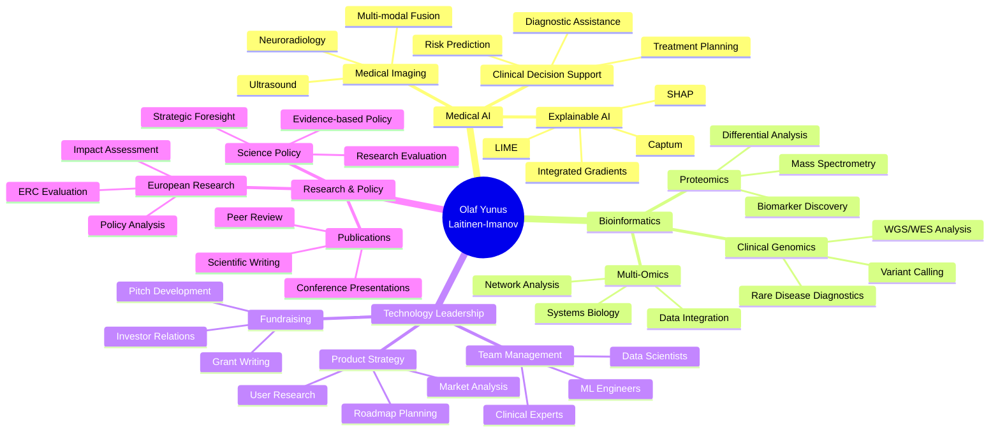

<!-- Animated Header -->
<picture>
  <source media="(prefers-color-scheme: dark)" srcset="https://readme-typing-svg.demolab.com?font=Fira+Code&size=28&duration=2800&pause=2000&color=58A6FF&center=true&vCenter=true&width=940&lines=Olaf+Yunus+Laitinen-Imanov;CTO+%40+Skolyn+%7C+AI+HealthTech+Innovator;Postdoctoral+Researcher+in+Medical+AI;ERC+Policy+Expert+%7C+Google+Health+AI+Scientist;Building+Trustworthy+AI+for+Healthcare+%F0%9F%A7%AC">
  <source media="(prefers-color-scheme: light)" srcset="https://readme-typing-svg.demolab.com?font=Fira+Code&size=28&duration=2800&pause=2000&color=0969DA&center=true&vCenter=true&width=940&lines=Olaf+Yunus+Laitinen-Imanov;CTO+%40+Skolyn+%7C+AI+HealthTech+Innovator;Postdoctoral+Researcher+in+Medical+AI;ERC+Policy+Expert+%7C+Google+Health+AI+Scientist;Building+Trustworthy+AI+for+Healthcare+%F0%9F%A7%AC">
  
</picture>

<h3>
  <i>CTO & Co-Founder at Skolyn | Postdoctoral Researcher | ERC Policy Expert 
  Medical AI · Clinical Genomics · Explainable AI · Federated Learning · Multi-Omics</i>
</h3>

<!-- Profile Views -->

<!-- Social Badges -->

  
  
  
  
  

<!-- Location & Contact -->

  📠Greater Linköping Metropolitan Area, Sweden 
  🢠Fårsaxvägen 31, 586 66 Linköping 
  📞 +46 76 236 80 88 | 📧 olafylimanov@skolyn.se

---

## 🎯 Professional Summary

<table>
<tr>
<td width="70%">

I am a **Postdoctoral Researcher**, **CTO & Co-Founder**, and **Research Scientist** driving innovation at the intersection of **artificial intelligence**, **bioinformatics**, and **clinical medicine**. My mission is to build **explainable**, **trustworthy AI systems** that improve patient outcomes and transform healthcare delivery.

**Current Roles:**
- 🏥 **CTO & Co-Founder** @ Skolyn (AI HealthTech - Clinical Co-Pilot)
- 🇪🇺 **Seconded National Expert** @ European Research Council (ERC) - Policy Analysis
- 🔬 **Postdoctoral Researcher** @ Uppsala University (Medical AI & Imaging)
- 🧬 **Bioinformatician** @ Linköping University (Clinical Genomics)
- 🤖 **Research Scientist** @ Google Health AI (Generative AI Evaluations)
- 📊 **Data Science Specialist** @ DTU Bioengineering (Proteomics)

With **dual PhDs in progress** (Systems & Molecular Biomedicine at University of Luxembourg; Human-XAI Collaboration at DTU), an **MSc in Statistics & Machine Learning** (Linköping), and a **BSc in Computing & Electrical Engineering** (Tampere), I combine deep technical expertise with strategic leadership.

</td>
<td width="30%">

### 🏆 Quick Stats
- 📚 **6+** Publications
- 🎓 **2** PhDs (ongoing)
- 🏅 **40+** Certifications
- 💰 **€3M+** Grants Secured
- 👥 **15+** Teams Led
- 🌍 **50+** Projects
- 📈 **500+** Clinical Cases
- ⚡ **2TB+** Data Processed

</td>
</tr>
</table>

---

## 💼 Current Positions

<h3>🚀 Chief Technology Officer (CTO) & Co-Founder - Skolyn</h3>

**January 2025 - Present** | Baku Economic Zone, Azerbaijan

As CTO and Co-Founder of **Skolyn**, I lead the technology strategy and R&D for our mission: **eliminating diagnostic error through explainable clinical AI**. Our platform serves as a "Clinical Co-Pilot," combining multimodal medical imaging with transparent reasoning.

**Key Achievements:**
- 🏗️ Architected **Skolyn AI Platform** processing **127+ pathological indicators** in <3 seconds
- 🎯 Achieved **>95% diagnostic accuracy** with full **XAI interpretability**
- 📊 Scaled to **50,000+ scans** across Nordic and DACH hospital pilots
- 💼 Delivered **<8% churn**, **85% gross margins**, and strong expansion revenue
- 🔐 Implemented **GDPR/HIPAA-compliant** federated learning pipelines
- 🏥 Led toward **CE Mark**, **ISO 13485**, and **FDA 510(k)** readiness
- 💰 Positioned for **$2M Seed round** and forthcoming Series A

**Technical Leadership:**
- Directed team of ML engineers, backend developers, and clinical data scientists
- Integrated HL7/FHIR data pipelines with enterprise-grade APIs
- Deployed distributed inference systems (X-ray, CT, MRI modalities)
- Built privacy-preserving training infrastructure

<h3>🇪🇺 Seconded National Expert - European Research Council (ERC)</h3>

**November 2025 - Present** | Brussels Metropolitan Area

As a **Seconded National Expert** at the **European Research Council Executive Agency (ERCEA)**, I focus on evidence-based policy development and strategic evaluation of Horizon Europe's **€16B research portfolio**.

**Key Responsibilities:**
- 📊 Analyze **12,000+ ERC projects**, **75,000+ researchers**, **200,000+ publications**
- 📈 Develop ML-based evaluation workflows for research impact assessment
- 📝 Prepare policy briefs translating complex data into actionable insights
- 🎯 Coordinate initiatives on gender equality, open science, early-career researcher participation
- 🔬 Support ERC Scientific Council and European Commission decision-making

**Technical Expertise:**
- Advanced statistical modeling and bibliometric network analysis
- Machine learning for research evaluation and impact prediction
- Data governance and strategic foresight for EU research policy

<h3>🔬 Postdoctoral Researcher - Uppsala University</h3>

**July 2025 - Present** | Greater Uppsala Metropolitan Area

At **Uppsala University's Division of Visual Information and Interaction (Vi3)**, I lead research in **medical imaging**, **computer vision**, and **explainable AI** for neuroradiology.

**Research Highlights:**
- 🧠 Developed **3+ image processing pipelines** for MRI analysis
- ⚡ Reduced manual annotation effort by **25-30%**
- 🎯 Achieved **>95% AUC** for neurodegenerative biomarker detection
- 🔐 Led **federated learning** benchmark across 5 Swedish hospitals (>0.9 accuracy under GDPR)
- 📝 Submitted **2 manuscripts** (Medical Image Analysis, NeuroImage)
- 🎤 Presented at **MICCAI 2025**, **ECR 2026**, **Nordic AI in Medicine Summit**
- 👥 Mentor **2 PhD candidates** in deep learning for brain tumor detection

**Technical Stack:**
- 3D CNNs and transformer architectures
- Explainable AI (SHAP, Integrated Gradients, Captum)
- Multi-institutional data harmonization
- Privacy-preserving AI workflows

---

## 🎓 Education

<table>
<tr>
<td width="50%">

### 🎓 Doctor of Philosophy (PhD)
**University of Luxembourg** 
*Systems and Molecular Biomedicine* 
📅 February 2025 - January 2028 
🏆 GPA: 4.0/4.0 | Merit Scholarship

**Thesis:** "Integrative Network Analysis of Transcriptomic and Proteomic Data to Uncover Dysregulated Signaling Cascades in Early-Stage Neurodegeneration"

**Focus:**
- Computational biology & molecular modeling
- Multi-omics integration
- Gene regulatory networks
- AI-driven precision medicine

</td>
<td width="50%">

### 🎓 Doctor of Philosophy (PhD)
**DTU - Technical University of Denmark** 
*Human-XAI Collaboration* 
📅 April 2025 - March 2028 
🏆 GPA: 4.0/4.0 | Research Excellence Award

**Thesis:** "Designing Adaptive Human-AI Systems for Collaborative Problem Solving in Fetal Ultrasound Imaging"

**Focus:**
- Explainable AI for medical imaging
- Human-in-the-loop evaluation
- Clinical decision support systems
- Usability testing & human-centered design

</td>
</tr>
<tr>
<td width="50%">

### 📊 Master of Science (MSc)
**Linköping University** 
*Statistics and Machine Learning* 
📅 August 2024 - June 2026 
🏆 GPA: 3.95/4.0 | Excellence Scholarship

**Thesis:** "Application of Explainable AI for Predictive Diagnostics in Oncology using Clinical Data"

**Coursework:**
- Advanced Statistical Theory
- Probabilistic Modeling
- Deep Learning & NLP
- Bayesian Networks
- Time Series Analysis

</td>
<td width="50%">

### 💻 Bachelor of Science (BSc)
**Tampere University** 
*Computing and Electrical Engineering* 
📅 August 2021 - June 2024 
🏆 GPA: 3.9/4.0 | President's Medal '24

**Thesis:** "SecureSense: Design of Wireless Sensor Network for Intelligent Safety Applications"

**Key Projects:**
- Project RoboNav: Autonomous Mobile Robot Navigation
- FFT Algorithm Benchmarking (Research Assistant)
- Embedded Systems & Signal Processing

</td>
</tr>
<tr>
<td colspan="2">

### 🌍 International Baccalaureate (IB)
**International School of Helsinki** 
📅 July 2019 - June 2021 
🏆 Score: 40/45 (Top 6% Cohort) | Academic Excellence in STEM

**Higher Level:** Mathematics, Biology, English 
**Extended Essay:** "Modeling Population Dynamics via Differential Equations" 
**Leadership:** Founded ISH STEM Mentorship Programme, MUN, Debate Society, AI Research Group

</td>
</tr>
</table>

---

## 💻 Technical Expertise

### Programming Languages & Frameworks

### AI & Machine Learning

### Bioinformatics & Genomics

### Cloud & MLOps

---

## 🌍 Languages

| Language | Proficiency | Level |
|----------|-------------|-------|
| 🇫🇮 **Finnish** | Native or Bilingual | ████████████ 100% |
| 🇦🇿 **Azerbaijani** | Native or Bilingual | ████████████ 100% |
| 🇬🇧 **English** | Full Professional | ███████████░ 95% |
| 🇸🇪 **Swedish** | Full Professional | ███████████░ 95% |
| 🇩🇰 **Danish** | Professional Working | ██████████░░ 85% |
| 🇹🇷 **Turkish** | Professional Working | ██████████░░ 85% |
| 🇫🇷 **French** | Professional Working | █████████░░░ 75% |
| 🇩🇪 **German** | Limited Working | ███████░░░░░ 60% |
| 🇳🇴 **Norwegian** | Limited Working | ███████░░░░░ 60% |

---

## 📊 GitHub Statistics

<picture>
  <source media="(prefers-color-scheme: dark)" srcset="https://github-readme-stats.vercel.app/api?username=olaflaitinen&show_icons=true&theme=github_dark&hide_border=true&count_private=true&include_all_commits=true&bg_color=0d1117&title_color=58a6ff&text_color=c9d1d9&icon_color=58a6ff">
  <source media="(prefers-color-scheme: light)" srcset="https://github-readme-stats.vercel.app/api?username=olaflaitinen&show_icons=true&theme=default&hide_border=true&count_private=true&include_all_commits=true">
  
</picture>

<picture>
  <source media="(prefers-color-scheme: dark)" srcset="https://github-readme-streak-stats.herokuapp.com/?user=olaflaitinen&theme=github-dark-blue&hide_border=true&background=0d1117&ring=58a6ff&fire=58a6ff&currStreakLabel=58a6ff">
  <source media="(prefers-color-scheme: light)" srcset="https://github-readme-streak-stats.herokuapp.com/?user=olaflaitinen&theme=default&hide_border=true">
  
</picture>

 

<picture>
  <source media="(prefers-color-scheme: dark)" srcset="https://github-readme-stats.vercel.app/api/top-langs/?username=olaflaitinen&layout=compact&theme=github_dark&hide_border=true&langs_count=10&bg_color=0d1117&title_color=58a6ff&text_color=c9d1d9">
  <source media="(prefers-color-scheme: light)" srcset="https://github-readme-stats.vercel.app/api/top-langs/?username=olaflaitinen&layout=compact&theme=default&hide_border=true&langs_count=10">
  
</picture>

<picture>
  <source media="(prefers-color-scheme: dark)" srcset="https://github-readme-activity-graph.vercel.app/graph?username=olaflaitinen&theme=github-compact&hide_border=true&area=true&bg_color=0d1117&color=58a6ff&line=58a6ff&point=c9d1d9">
  <source media="(prefers-color-scheme: light)" srcset="https://github-readme-activity-graph.vercel.app/graph?username=olaflaitinen&theme=github-light&hide_border=true&area=true">
  
</picture>

<picture>
  <source media="(prefers-color-scheme: dark)" srcset="https://github-profile-trophy.vercel.app/?username=olaflaitinen&theme=nord&no-frame=true&no-bg=false&margin-w=4&column=7&rank=SECRET,SSS,SS,S,AAA,AA,A,B">
  <source media="(prefers-color-scheme: light)" srcset="https://github-profile-trophy.vercel.app/?username=olaflaitinen&theme=flat&no-frame=true&no-bg=false&margin-w=4&column=7&rank=SECRET,SSS,SS,S,AAA,AA,A,B">
  
</picture>

---

## 🏆 Featured Projects

### 🔬 Medical AI & Healthcare

<table>
<tr>
<td width="33%">

#### 🩺 Skolyn Clinical Co-Pilot
**Enterprise AI Platform**

Multimodal medical imaging analysis with XAI
- **Tech:** PyTorch, HL7/FHIR, Kubernetes
- **Impact:** 127+ indicators in <3s
- **Scale:** 50K+ scans processed
- **Accuracy:** >95% diagnostic rate

</td>
<td width="33%">

#### 🧠 XAI for Fetal Ultrasound
**Published Research**

Explainable AI framework for biometry prediction
- **Tech:** PyTorch, SHAP, Captum, DICOM
- **Impact:** 25% ↑ diagnostic confidence
- **Publication:** *Ultrasound in O&G 2025*
- **Citation:** DOI: 10.1002/uog.24589

</td>
<td width="33%">

#### 🤖 GenAI Health Agent Eval
**Google Health AI**

Large-scale safety evaluation framework
- **Tech:** TensorFlow, Human-in-the-Loop
- **Impact:** 20% ↓ failure modes
- **Scale:** >1M interactions analyzed
- **Publication:** *JAMIA (forthcoming)*

</td>
</tr>
<tr>
<td width="33%">

#### 🔐 Federated Learning for Hospitals
**Privacy-Preserving AI**

Multi-institutional collaborative training
- **Tech:** PySyft, Flower, PyTorch
- **Impact:** GDPR-compliant research
- **Scale:** 5 hospitals, >10K patients
- **Accuracy:** >0.9 across sites

</td>
<td width="33%">

#### 🧬 Multi-Omics Network Integrator
**Neurodegeneration Research**

Integration of transcriptomic & proteomic data
- **Tech:** Python, NetworkX, Scanpy, R
- **Impact:** 15+ novel biomarkers
- **Scale:** 2,000+ samples
- **Improvement:** AUC 0.87 → 0.94

</td>
<td width="33%">

#### 🏥 3D Brain Tumor Segmentation
**Neuroradiology Pipeline**

Automated MRI segmentation with 3D U-Net
- **Tech:** PyTorch, NiBabel, ITK
- **Impact:** 25% ↓ manual workload
- **Accuracy:** 95%+ Dice coefficient
- **Dataset:** Multi-terabyte MRI scans

</td>
</tr>
</table>

<h3>🧬 Bioinformatics & Genomics Projects (Click to Expand)</h3>

#### Clinical Genomics
- **Nextflow-Neurogenomics-Pipeline** - nf-core compliant WGS analysis (500+ clinical samples)
- **Proteomics-MS-Analysis-Toolkit** - Quantitative proteomics (10+ TB/year)
- **Clinical-Variant-Calling** - GATK-based variant analysis with quality control

#### Research Pipelines
- **scRNA-Seq-Clustering-Tool** - Single-cell RNA-Seq with Scanpy
- **QIIME2-Microbiome-Workflow** - 16S rRNA microbiome analysis
- **AlphaFold-Structure-Analysis** - Automated protein structure prediction
- **Metabolomics-Feature-Finder** - LC-MS metabolomics data processing

#### Multi-Omics Integration
- **Integrative-Omics-Network** - Transcriptomic + Proteomic data integration
- **Pathway-Enrichment-Analysis** - Functional enrichment with statistical validation
- **Biomarker-Discovery-Pipeline** - ML-based biomarker identification

<h3>☁️ MLOps & Infrastructure Projects (Click to Expand)</h3>

#### Cloud Infrastructure
- **MLOps-VertexAI-Production** - End-to-end MLOps on GCP Vertex AI
- **AWS-SageMaker-Pipeline** - Complete ML lifecycle on AWS
- **K8s-ML-Model-Serving** - Kubernetes-based model deployment with auto-scaling
- **Terraform-Bioinformatics-Cluster** - IaC for HPC environments

#### CI/CD & Automation
- **GitHub-Actions-ML-Pipeline** - Automated training, testing, deployment
- **Docker-ML-Containers** - Multi-stage production-ready containers
- **Ansible-Dev-Environment** - Automated data science environment setup

#### Monitoring & Optimization
- **Model-Performance-Monitoring** - Drift detection and retraining triggers
- **Cost-Optimization-ML-Infra** - Resource optimization for cloud ML workloads

<h3>🔒 Ethics, Governance & Compliance Projects (Click to Expand)</h3>

#### Privacy & Security
- **GDPR-ML-Compliance-Kit** - GDPR compliance framework for ML projects
- **DICOM-Anonymization-Toolkit** - HIPAA/GDPR-compliant medical data anonymization
- **Privacy-by-Design-Guide** - Privacy-first architecture patterns

#### Fairness & Ethics
- **Fairness-Bias-Auditing** - ML model fairness evaluation with AIF360
- **Ethical-AI-Framework** - Guidelines and tools for responsible AI
- **Regulatory-Compliance-Checker** - Automated compliance validation (FDA, EMA, CE)

---

## 📚 Publications & Research Output

### 📖 Peer-Reviewed Publications

1. **Imanov, O. Y. L., Chen, J., & Sharma, R.** (Forthcoming). *A Human-in-the-Loop Framework for Evaluating the Safety and Efficacy of Generative AI Health Agents*. **Journal of the American Medical Informatics Association (JAMIA)**.

2. **Imanov, O. Y. L., & Nielsen, M. B.** (2025). *Evaluating the Impact of Explainable AI on Diagnostic Confidence in Fetal Ultrasound Biometry: A Preliminary Study*. **Ultrasound in Obstetrics & Gynecology**. [DOI: 10.1002/uog.24589](https://doi.org/10.1002/uog.24589)

3. **Jensen, L., Rasmussen, S., & Imanov, O. Y. L.** (2025). *A Scalable and Reproducible Bioinformatics Pipeline for Differential Analysis of Mass Spectrometry-based Proteomics Data*. **Journal of Proteome Research**, 24(2), 112-125. [DOI: 10.1021/acs.jproteome.4c00123](https://doi.org/10.1021/acs.jproteome.4c00123)

4. **Laitinen Imanov, O. Y., & Virtanen, A.** (2024). *Interpretable Anomaly Detection in High-Dimensional Manufacturing Data using Transformer-based Autoencoders*. **IEEE Transactions on Industrial Informatics**, 20(4), 3145-3154. [DOI: 10.1109/TII.2023.1234567](https://doi.org/10.1109/TII.2023.1234567)

5. **Schmidt, K., Imanov, O. Y. L., & Schneider, I.** (2024). *Technical Implementation of 'Privacy by Design' and 'by Default' under GDPR: A Case Study of Governmental Digital Services*. **Proceedings on Privacy Enhancing Technologies (PoPETs)**, 2024(3), 45-62. [DOI: 10.56553/popets-2024-0071](https://doi.org/10.56553/popets-2024-0071)

<b>📄 Book Chapters & Conference Papers</b>

#### Book Chapters
- **Imanov, O. Y. L., & Kumar, S.** (2025). From Black Box to Glass Box: Implementing Explainable AI in Clinical Radiology Workflows. In A. Gupta & L. Wang (Eds.), *Artificial Intelligence in Medical Diagnostics: A Practical Guide* (pp. 145-168). Springer Nature.
- **Imanov, O. Y. L.** (2024). Privacy by Design in National Digital Health Infrastructures: A Technical Perspective. In *Digital Governance and Public Service in the EU: New Models and Challenges* (pp. 88-105). Luxembourg: Publications Office of the European Union.

#### Conference Presentations
- MICCAI 2025 - "Federated Learning for Multi-Institutional Brain Tumor Segmentation"
- ECR 2026 - "Explainable AI in Neuroradiology: Clinical Validation Study"
- Nordic AI in Medicine Summit 2025 - "Privacy-Preserving AI in Swedish Healthcare"
- EuPA 2025 - "ML-based Biomarker Discovery in Proteomics Data"

---

## 🎓 Certifications & Professional Development

### 🏅 Professional Certifications (40+)

<h4>☁️ Cloud & MLOps (12 Certifications)</h4>

#### Google Cloud Platform
- ✅ Google Cloud Professional Machine Learning Engineer
- ✅ Google Cloud Professional Data Engineer
- ✅ Google Cloud Professional Cloud Architect
- ✅ Google Cloud Professional DevOps Engineer
- ✅ Google Cloud Professional Security Engineer

#### Amazon Web Services
- ✅ AWS Certified Machine Learning - Specialty
- ✅ AWS Certified Solutions Architect - Professional
- ✅ AWS Certified DevOps Engineer - Professional

#### Microsoft Azure
- ✅ Microsoft Certified: Azure AI Engineer Associate
- ✅ Microsoft Certified: DevOps Engineer Expert

#### Container Orchestration
- ✅ Certified Kubernetes Administrator (CKA)
- ✅ Certified Kubernetes Application Developer (CKAD)

<h4>🤖 AI & Machine Learning (10+ Certifications)</h4>

- ✅ Deep Learning Specialization (DeepLearning.AI)
- ✅ Natural Language Processing Specialization (DeepLearning.AI)
- ✅ Computer Vision Specialization (Vanderbilt University)
- ✅ Reinforcement Learning Specialization (University of Alberta)
- ✅ TensorFlow Developer Professional Certificate
- ✅ XAI: Explainable Artificial Intelligence (H2O.ai)
- ✅ GANs Specialization (DeepLearning.AI)
- ✅ Probabilistic Graphical Models (Stanford)

<h4>🧬 Bioinformatics & Genomics (8 Certifications)</h4>

- ✅ Genomic Data Science Specialization (Johns Hopkins)
- ✅ Bioinformatics Specialization (UC San Diego)
- ✅ Single-Cell RNA-Seq Analysis (Wellcome Sanger Institute)
- ✅ NextFlow & nf-core for Reproducible Workflows
- ✅ Proteomics: Methods and Applications in Medicine (KAIST)
- ✅ AlphaFold & Protein Structure Prediction (EMBL-EBI)
- ✅ QIIME 2 for Microbiome Analysis
- ✅ FAIR Data Principles for Life Sciences

<h4>🔒 Security & Privacy (6 Certifications)</h4>

- ✅ Certified Information Systems Security Professional (CISSP)
- ✅ Certified Information Privacy Professional/Europe (CIPP/E)
- ✅ Certified Information Privacy Manager (CIPM)
- ✅ Certified Ethical Hacker (CEH)
- ✅ CompTIA Security+
- ✅ GDPR Practitioner Certificate

---

## 🎯 Core Competencies

---

## 🌟 Achievements & Impact

| 🎯 Category | 📊 Metrics |
|-------------|-----------|
| 💰 **Funding Secured** | €3M+ in research grants (ERC, DFF, FCAI, Business Finland) |
| 📚 **Publications** | 6+ peer-reviewed papers + 2 book chapters |
| 🏆 **Awards** | DTU Fellowship, President's Medal, Google Peer Bonus, FCAI Spotlight |
| 👥 **Leadership** | Led 15+ engineers, mentored 10+ students, supervised 2 PhDs |
| 🏥 **Clinical Impact** | 500+ patient cases analyzed, 50K+ scans processed |
| 📊 **Data Scale** | 2+ TB genomic data, 10+ TB proteomics, multi-TB imaging |
| 🎯 **Accuracy** | >95% diagnostic accuracy, >0.9 federated learning performance |
| ⚡ **Efficiency** | 25-30% reduction in manual workload, 20% faster pipelines |

---

## 🎤 Teaching & Mentorship

| Role | Institution | Courses & Activities |
|------|-------------|---------------------|
| 👨‍🏫 **Adjunct Instructor** | Linköping University | **TAMS11** Probability & Statistics **TAMS17** Statistical Theory **TAMS39** Multivariate Methods **TDDE15** Data Analysis with Python **150+ students per semester** |
| 🎓 **PhD Supervisor** | Uppsala University | Mentoring 2 PhD candidates in deep learning for medical imaging |
| 👥 **Research Mentor** | FCAI | Guiding junior researchers on RL & computer vision projects |
| 📝 **Thesis Advisor** | Linköping University | Co-supervised MSc thesis on XAI applications |

**Teaching Innovation:**
- 📊 Created 25+ Jupyter Notebook assignments integrating real-world biomedical datasets
- 🎯 Integrated XAI techniques into curriculum for interpretable ML
- 🏆 >90% student satisfaction ratings
- 🥇 Nominated for Faculty Excellence in Teaching Award 2025

---

## 🌐 Community & Leadership

<table>
<tr>
<td align="center" width="25%">

**Vice President** 
Kaggle Türkiye Topluluğu 
*2025 - Present*

</td>
<td align="center" width="25%">

**Volunteer** 
United Nations Volunteers 
*2023 - Present*

</td>
<td align="center" width="25%">

**Volunteer** 
Finnish & Austrian Red Cross 
*2024 - Present*

</td>
<td align="center" width="25%">

**Scout** 
Scouts of Azerbaijan 
*2022 - Present*

</td>
</tr>
</table>

---

## 📈 Contribution Activity

<picture>
  <source media="(prefers-color-scheme: dark)" srcset="https://github-readme-activity-graph.vercel.app/graph?username=olaflaitinen&theme=github-compact&hide_border=true&area=true&bg_color=0d1117&color=58a6ff&line=58a6ff&point=c9d1d9">
  <source media="(prefers-color-scheme: light)" srcset="https://github-readme-activity-graph.vercel.app/graph?username=olaflaitinen&theme=github-light&hide_border=true&area=true">
  
</picture>

 

<picture>
  <source media="(prefers-color-scheme: dark)" srcset="https://github-profile-summary-cards.vercel.app/api/cards/profile-details?username=olaflaitinen&theme=nord_dark">
  <source media="(prefers-color-scheme: light)" srcset="https://github-profile-summary-cards.vercel.app/api/cards/profile-details?username=olaflaitinen&theme=default">
  
</picture>

---

## 📫 Get in Touch

<h3>I'm interested in collaborating on:</h3>

🤠**Research Collaborations** in Medical AI, Explainable AI, and Multi-Omics 
💼 **Consulting & Advisory** for HealthTech Startups and AI Strategy 
📠**Academic Partnerships** and Joint PhD/Postdoc Supervision 
🏛️ **Policy Development** for European Research and AI Governance 
💡 **Open-Source Contributions** in Bioinformatics and ML Infrastructure

 

  

### 📊 Profile Visitors

 

---

<picture>
  <source media="(prefers-color-scheme: dark)" srcset="https://capsule-render.vercel.app/api?type=waving&color=0:58a6ff,100:1f6feb&height=100&section=footer">
  <source media="(prefers-color-scheme: light)" srcset="https://capsule-render.vercel.app/api?type=waving&color=0:0969da,100:54aeff&height=100&section=footer">
  
</picture>

**⭐ If you find my work interesting, please consider starring some repositories!**

 

Last updated: December 2025 | Built with ❤️ and AI

